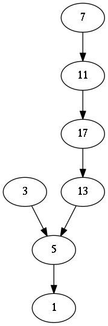

Collatz
=======

Helper functions for investigating the Collatz Conjecture and visualizing the orbits of the corresponding sequence it describes. Inputs are restricted to the natural numbers.

Subsequent hailstone numbers are computed using step/1:
```
iex> Collatz.step 7
22
iex> Collatz.step 22
11
iex> 11 |> Collatz.step |> Collatz.step
17
```

A hailstone sequence containing only the odd numbers is produced with run_odd/1:
```
iex> Collatz.run_odd 7
[7, 11, 17, 13, 5, 1]
```

A complete hailstone sequence is produced with run/1:
```
iex> Collatz.run 7
[7, 22, 11, 34, 17, 52, 26, 13, 40, 20, 10, 5, 16, 8, 4, 2, 1]
```

The graph/1 function generates dot for producing GraphViz diagrams:
```
iex> IO.puts Collatz.graph 1..7
digraph G {
  3 -> 5;
  5 -> 1;
  7 -> 11;
  11 -> 17;
  13 -> 5;
  17 -> 13;
}

:ok
```



